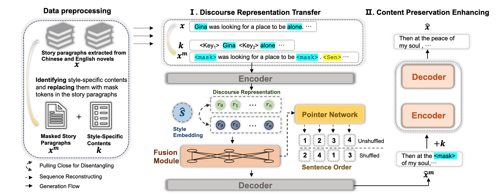

# StoryTrans

This repo inculdes the code in the paper [StoryTrans: Non-Parallel Story Author-Style Transfer with Discourse Representations and Content Enhancing](https://arxiv.org/abs/2208.13423) (ACL 2023 Long Paper).

StoryTrans leverages discourse representations to capture source content information and transfer them to target styles with learnable style embeddings. 



## Prerequisites

The prerequisites for running the code are listed in the `requirement.txt`. Make sure you have the necessary environment and dependencies set up before proceeding with the installation and execution of the code.

To install the required dependencies, you can use pip or conda to install the package in `requirement.txt`.

## Data and pre-trained classifier
All our constructed data are in text_style_transfer/data
```markdown
├── Data
   └── en   # the English story including everyday stories and Shakespeare’s plays.
   └── zh   # the Chinese story including fairy tales, LuXun (LX), and JinYong (JY).
```
Data example:
```json
"text": ["Cask . Marry , before he fell downe , when he perceiu ' d the common Heard was glad he refus ' d the Crowne , he pluckt me ope his Doublet , and offer ' d them his Throat to cut : and I had beene a man of any Occupation , if I would not haue taken him at a word , I would I might goe to Hell among the Rogues , and so hee fell ."], "style": "<Sp>", "mask_word": ["taken", "Throat", "refus", "Rogues", "Heard", "Doublet", "Occupation", "fell"], "text_mask": ["Cask . Marry , before he <mask> downe , when he perceiu ' d the common <mask> was glad he <mask> ' d the Crowne , he pluckt me ope his <mask> , and offer ' d them his <mask> to cut : and I had beene a man of any <mask> , if I would not haue <mask> him at a word , I would I might goe to Hell among the <mask> , and so hee <mask> ."]
```
The classifier is very easy to train, you can pre-train the style classifier by yourself or download at [pre-trained classifier](https://drive.google.com/drive/folders/1vEYveDCMqyCq3okUqaHMpCjVetmerWRE?usp=sharing).

## Quick Start

#### 1. Training of Discourse Representation Transfer

Execute the following command to train for first stage: 
```shell
sh text_style_transfer/StyTrans_tran.sh
```

#### 2. Training of Content Preservation Enhancing
Execute the following command to train for second stage: 
```shell
sh text_style_transfer/MaskFill_train.sh
```

#### 3. Generation 
Execute the following command to generate your style transfer texts: 
```shell
sh text_style_transfer/StyTrans_stage_1_test_zh.sh
sh text_style_transfer/MaskFill_gen_zh.sh
```

### Citation

Please kindly cite our paper if this paper and the code are helpful.

```
@article{zhu2022storytrans,
  title={StoryTrans: Non-Parallel Story Author-Style Transfer with Discourse Representations and Content Enhancing},
  author={Zhu, Xuekai and Guan, Jian and Huang, Minlie and Liu, Juan},
  journal={arXiv preprint arXiv:2208.13423},
  year={2022}
}
```
